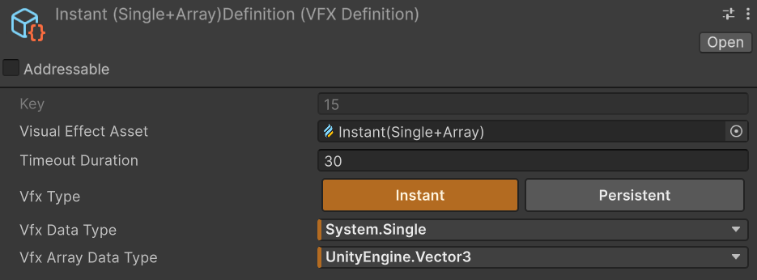
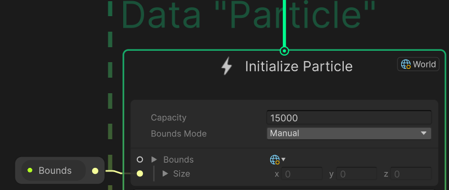
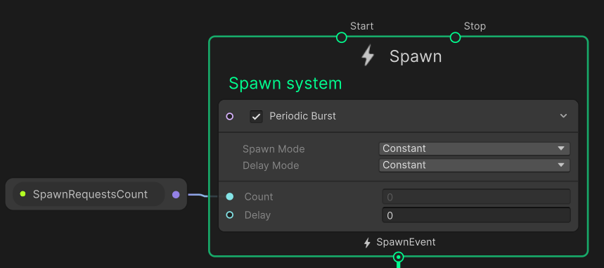
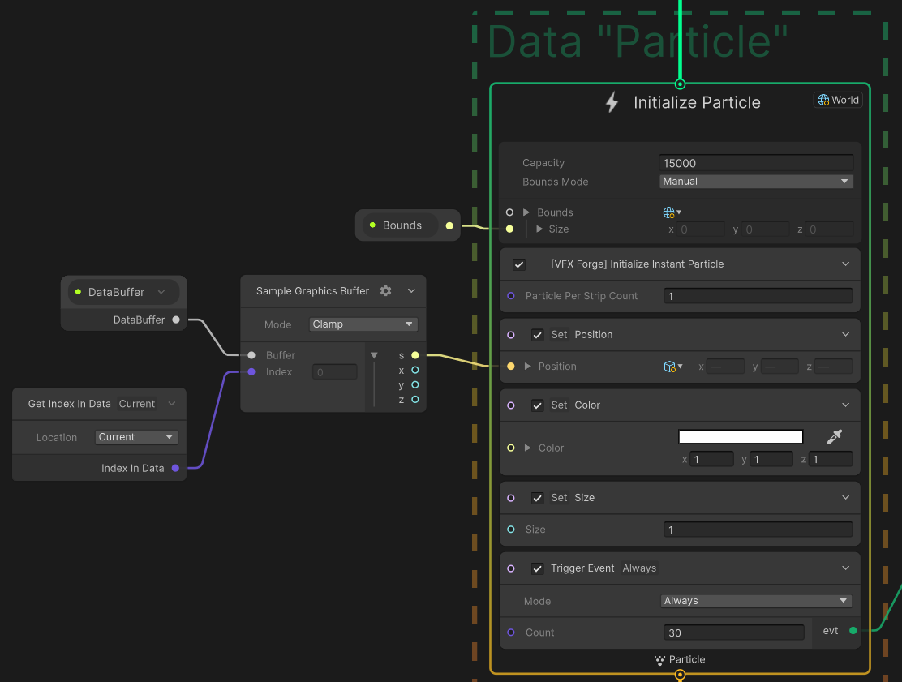
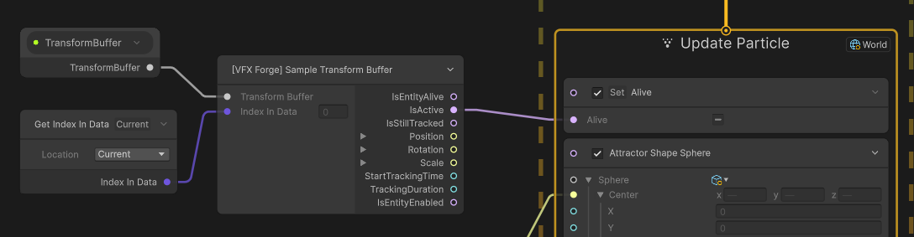
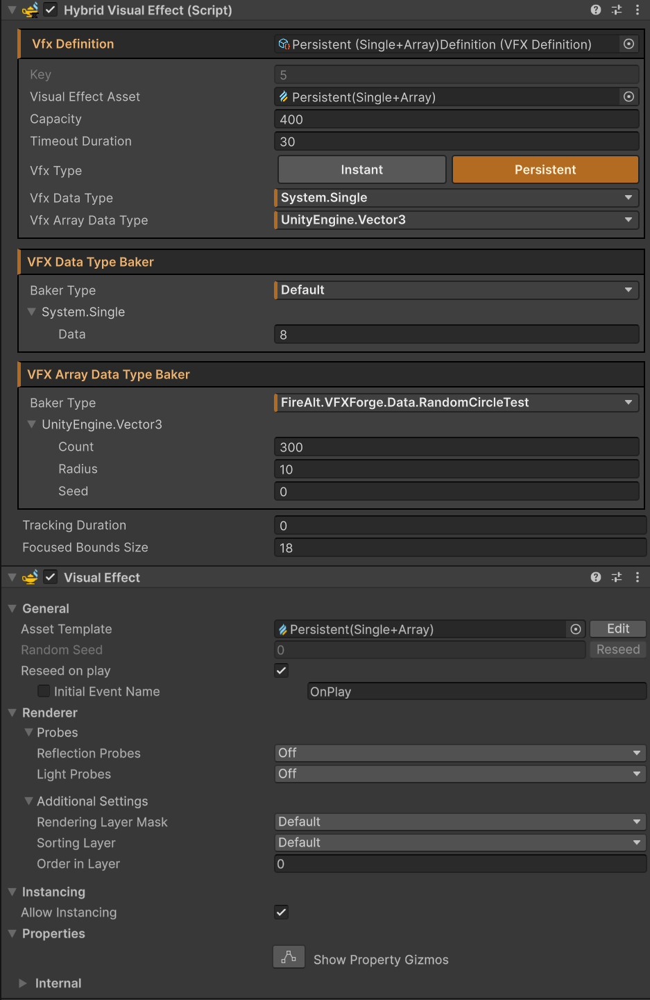

# Getting Started

1. Create unmanaged payload structs and mark custom payloads with `[VFXType(VFXTypeAttribute.Usage.GraphicsBuffer)]`.
2. Create or choose a VFX Graph template from `Shaders/Templates`.
3. Select the VFX Graph asset and run `FireAlt/Create VFX Definitions from VFX Assets` on the main toolbar.
4. Configure the generated `VFXDefinition`: choose `Instant` or `Persistent`, set capacity and timeout, and select the single payload and array payload types.
5. Use the generated GameObject with `VisualEffect` and `HybridVisualEffect`. The menu creates and wires it to the generated definition.
6.
    1. From ECS, fetch `VFXSingleton` using `SystemAPI.GetSingleton<VFXSingleton>()`, get the registered entry by `VFXKey`, and call `Spawn`.
    2. From MonoBehavior, fetch `VFXSingleton` using `GlobalVFXSingleton.Get()`, get the registered entry by `VFXKey`, and call `Spawn`.

## Authoring VFX Data Types

Payload types must be unmanaged. Custom payload structs should be marked with `VFXTypeAttribute` so VFX Graph would see them and VFX Forge can discover them and expose them in definition dropdowns.

```csharp
using UnityEngine;
using UnityEngine.VFX;

[VFXType(VFXTypeAttribute.Usage.GraphicsBuffer)]
public struct VFXHitSparksRequest
{
    public Vector3 Position;
    public Vector3 Color;
}
```

Array payloads are authored the same way:

```csharp
using UnityEngine.VFX;

[VFXType(VFXTypeAttribute.Usage.GraphicsBuffer)]
public struct VFXDamageNumberGlyph
{
    public uint GlyphIndex;
}
```

Built-in supported Unity types include `int`, `uint`, `float`, `Vector2`, `Vector3`, `Vector4`, and `Matrix4x4`.

### Data Bakers

`VFXDataTypeBaker<T>` bakes one payload value for editor preview.

```csharp
using System;
using FireAlt.VFXForge.Data;
using UnityEngine;

[Serializable] // Must be marked with System.Serializable to be able to see in the inspector
public class HitSparkBaker : VFXDataTypeBaker<VFXHitSparksRequest>
{
    public Vector3 Position;
    public Color Color; // DataBakers are useful to convert arbitrary data into a VFX ready data

    public override VFXHitSparksRequest Bake()
    {
        return new VFXHitSparksRequest
        {
            Position = Position,
            Color = Color.rgb,
        };
    }
}
```

`VFXArrayDataTypeBaker<T>` bakes variable-length array payloads.

```csharp
using System;
using FireAlt.VFXForge.Data;
using Unity.Collections;

[Serializable] // Must be marked with System.Serializable to be able to see in the inspector
public class DamageGlyphBaker : VFXArrayDataTypeBaker<VFXDamageNumberArrayData>
{
     public int number;
     
     public override NativeArray<VFXDamageNumberArrayData> Bake()
     {
         var list = new NativeList<VFXDamageNumberArrayData>(Allocator.Temp);
         BakeGlyphs(number, list); // Populate the NativeList with any data (the implementation is omitted)
         return list.AsArray();
     }
}
```

Default bakers exist for every registered payload type, but for them to be visible in the inspector, a `[System.Serializable]` is required on the VFX data type.
Custom bakers are only needed when the default field editor is not enough, and do not require `[System.Serializable]` on the VFX data type.

## Creating VFX Definitions



`VFXDefinition` fields:

| Field               | Purpose                                                                                                                 |
|---------------------|-------------------------------------------------------------------------------------------------------------------------|
| `visualEffectAsset` | VFX Graph asset assigned to the backing `VisualEffect`.                                                                 |
| `vfxType`           | `Instant` or `Persistent`.                                                                                              |
| `capacity`          | Maximum active persistent entries. Persistent buffers allocate extra backing storage to handle holes and delayed reuse. |
| `timeoutDuration`   | How long an inactive graph remains enabled before buffers are disposed and the GameObject is deactivated.               |
| `vfxDataType`       | Optional per-spawn or per-instance payload type.                                                                        |
| `vfxArrayDataType`  | Optional variable-length array payload type.                                                                            |

## VFX Graph Requirements

The graph must expose `Bounds` as a `Vector3`. `HybridVisualEffect` uses it to fully remove the need to adjust the bounds in the VFX Asset itself:



VFX Forge provides several VFX Asset properties which can be used in the graph to fetch the VFX Forge data:

| Property                  | Type             | Purpose                                                       |
|---------------------------|------------------|---------------------------------------------------------------|
| `SpawnRequestsCount`      | `uint`           | Number of single-instance spawn requests uploaded this frame. |
| `SpawnArrayRequestsCount` | `uint`           | Number of array element spawn requests uploaded this frame.   |
| `DataBuffer`              | `GraphicsBuffer` | Per-spawn or per-instance data payload.                       |
| `ArrayDataBuffer`         | `GraphicsBuffer` | Contiguous array payload data.                                |
| `ArrayPtrBuffer`          | `GraphicsBuffer` | Per-spawn pointer/count metadata into array data.             |
| `ArraySpawnIndexBuffer`   | `GraphicsBuffer` | Index mapping for array element particles.                    |
| `SpawnIndexBuffer`        | `GraphicsBuffer` | Persistent spawn index list for newly activated entries.      |
| `TransformBuffer`         | `GraphicsBuffer` | Persistent transform/lifetime data.                           |

Every VFX Asset should start with a Spawn system which will be driven either by `SpawnRequestsCount` or `SpawnArrayRequestsCount` depending by data layout:



Required buffers depend on the definition:

- Instant graphs with single payload data need `DataBuffer`.
- Instant graphs with array payload data need `ArrayDataBuffer`, `ArrayPtrBuffer`, and `ArraySpawnIndexBuffer`.
- Persistent graphs always need `TransformBuffer` (to, at the very least, read `IsActive` status).
- Persistent graphs with single payload data need `DataBuffer` and may need `SpawnIndexBuffer` depending on graph shape.
- Persistent graphs with array payload data need `ArrayDataBuffer`, `ArrayPtrBuffer`, and may need `ArraySpawnIndexBuffer` depending on graph shape.

The included VFX Graph templates and blocks will greatly simplify the boilerplate needed to setup a VFX Asset. These are:

- `Shaders/Templates/Instant(Single).vfx`
- `Shaders/Templates/Instant(Array).vfx`
- `Shaders/Templates/Instant(Single+Array).vfx`
- `Shaders/Templates/Persistent(Single).vfx`
- `Shaders/Templates/Persistent(Array).vfx`
- `Shaders/Templates/Persistent(Single+Array).vfx`
- `[VFX Forge] Initialize Instant Particle`
- `[VFX Forge] Initialize Array Particle`
- `[VFX Forge] Initialize Persistent Particle`
- `[VFX Forge] Initialize Persistent Particle (With Array)`

To initialize a particle use one of the provided blocks and fetch the data as needed (provided VFX Templates cover each scenario):



When working with Persistent VFXs, you must use "Sample Transform Buffer" operator to at least sync the lifetime of the data to the lifetime of the particle. By definition, data lifetime controls the lifetime of the particle, not the other way around:



My personal preferred way is to use one of the templates provided and build the graph from there.
The templates come with all VFX Forge fields needed for a given effect and are orginized in a "Internal" property folder to reduce clutter.

## Registering a Visual Effect

`HybridVisualEffect` is the bridge between Unity's `VisualEffect` component and VFX Forge.



It:

- Requires a `VisualEffect` component.
- Assigns the definition's graph asset to the `VisualEffect`.
- Registers an ECS entity with `RegisteredVFX` and `HybridVisualEffectData`.
- Calls `InitializeVFXSystem` so the runtime entry is available.
- Deactivates the graph GameObject in play mode until there are pending requests or editor preview activity.
- Reinitializes the graph during cleanup.

Each `VFXDefinition` key can only be registered once in a world. Duplicate registrations are rejected.

Projects usually define a small key wrapper such as `VFXKeys` so gameplay systems do not pass raw numbers around:

```csharp
using FireAlt.VFXForge.Data;

public struct VFXKeys
{
    public const ushort Explosion = 1;

    private ushort _value;

    public static implicit operator VFXKey(VFXKeys value)
    {
        return new VFXKey { Value = value._value };
    }

    public static implicit operator VFXKeys(ushort value)
    {
        return new VFXKeys { _value = value };
    }
}
```

## API

To read about available public API, see [Instant VFX](InstantVFX.md) and [Persistent VFX](PersistentVFX.md).